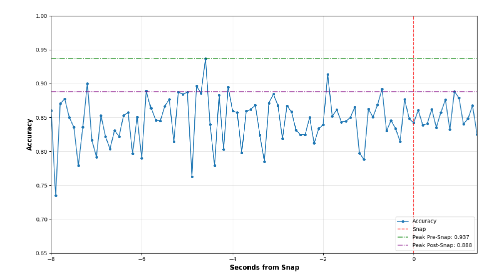

# NFL Defensive Coverage Classification

This project utilizes player tracking data to classify NFL defensive coverages into **Man** or **Zone** schemes. By comparing three distinct neural architectures, the study identifies which models best capture the spatial and temporal nuances of defensive play.

---

##  Project Overview
Defensive coverage identification is a cornerstone of modern football analytics. This project leverages raw tracking data (X/Y coordinates, velocity, and orientation) to predict defensive intent. 

### Data Source
> **Note on Data Acquisition:** The datasets used in this project are sourced from the **[2025 NFL Big Data Bowl on Kaggle](https://www.kaggle.com/competitions/nfl-big-data-bowl-2025)**. This includes player-level tracking data, play metadata, and scouting labels.

### Model Performance Summary

* **Transformer:** The top performer with a **test accuracy of 0.8438**. It achieved a **peak pre-snap accuracy of 0.9365**, demonstrating the power of the self-attention mechanism in capturing player-to-player relationships.
* **Multi-Layer Perceptron (MLP):** A robust baseline that pools player features for a global classification.
* **Neural Additive Model (NAM):** An interpretable architecture that evaluates the contribution of individual features (like velocity or positioning) independently.

---

## Repository Structure

### 1. Data Core (Shared)
* `bdb_cleaning_functions_01.py`: Core preprocessing: coordinate rotation, left-to-right normalization, and velocity calculation.
* `bdb_dataloading_02.py`: Data ingestion, snap-alignment, and Gaussian-weighted **data augmentation**.

### 2. Multi-Layer Perceptron (MLP) Track
* `bdb_training_mlp_03.py`: Training script with **Bayesian Optimization** (Optuna) for MLP hyperparameters.
* `bdb_preds_mlp_04.py`: Inference script for generating MLP test set predictions.
* `bdb_evaluation_mlp_05.py`: Visualization and accuracy-over-time analysis for the MLP model.

### 3. Neural Additive Model (NAM) Track
* `bdb_training_nam_03.py`: Training script with **Bayesian Optimization** (Optuna) for NAM hyperparameters.
* `bdb_preds_nam_04.py`: Inference script for generating NAM test set predictions.
* `bdb_evaluation_nam_05.py`: Visualization and accuracy-over-time analysis for the NAM model.

### 4. Transformer Track
* `bdb_training_transformers_03.py`: Training script for the Transformer model.
* `bdb_preds_transformer_04.py`: Inference script for generating Transformer test set predictions.
* `bdb_evaluation_transformer_05.py`: Visualization and accuracy-over-time analysis for the Transformer model.

---

## Data Pipeline & Features
The pipeline transforms raw CSV tracking data into standardized PyTorch tensors.
* **Standardization:** All plays are normalized to a left-to-right direction.
* **Features:** Inputs include `x_clean`, `y_clean`, `v_x`, `v_y`, and a `defense` toggle.
* **Temporal Focus:** The model filters for frames between -15.0 and +5.0 seconds relative to the snap, with augmentation centered on the pre-snap window.

---

## Results & Evaluation
The project evaluates accuracy across the "life" of a play. Results indicate that defensive schemes are most predictable in the **pre-snap phase** (approx. 1 second before the ball moves), where player alignments provide the strongest signals for the Transformer's attention heads.

---

##  Getting Started

### Prerequisites
* Python 3.8+
* PyTorch
* CUDA (optional, for GPU acceleration)
  
## Requirements
> **Note:** Use the provided `requirements.txt` to set up your environment. Ensure you have `torch`, `optuna`, `pandas`, `numpy`, and `matplotlib` installed.

### Workflow
### 1. Initialization
Run `bdb_dataloading_02.py` to process the Kaggle Big Data Bowl CSVs. This generates the `.pt` tensor files required for training and testing.

### 2. Parallel Training Tracks
Choose an architecture and run its respective `_03.py` script (e.g., `bdb_training_mlp_03.py`). This triggers **Optuna** to find optimized parameters like `hidden_dim`, `num_layers`, and `learning_rate`.

### 3. Prediction & Inference
Once the best model `.pth` file is saved, run the corresponding `_04.py` script to generate a CSV of predictions (e.g., `week_1_preds_transformer.csv`).

### 4. Evaluation
Run the `_05.py` scripts to generate "Accuracy by Frame" visualizations, allowing you to see exactly when the model is most confident during the pre-snap and post-snap phases.
